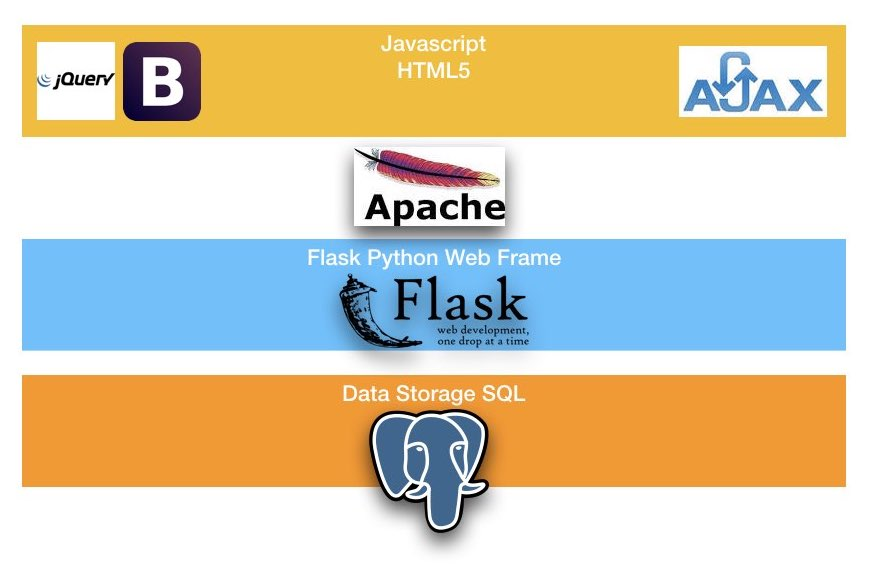

# Web App: green-moon
This is a web app used to be hosted on a [Linode](https://www.linode.com) server with the following architecture.




The structure of the app is sketched below:


```
/green-moon
    setup.py
    /yourapplication
        __init__.py
        views.py
        /static
            style.css
        /templates
            layout.html
            index.html
            login.html
            ...

```


#### A screen-shot of the front page.
